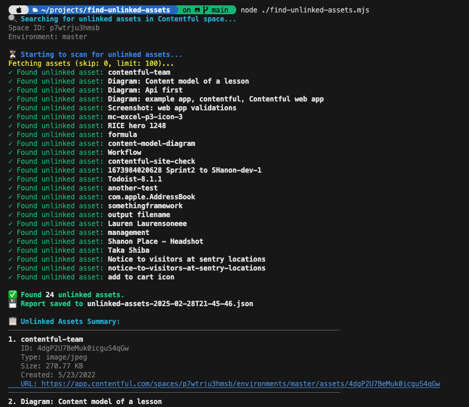

# 📂 Unlinked Assets Finder for Contentful

This script identifies unlinked assets in a Contentful space by scanning entries and checking for assets that are not referenced.

## 🚀 Prerequisites

- 🖥️ Node.js (latest LTS version recommended)
- 🔑 A Contentful API key with read access
- 📄 A `.env` file with Contentful credentials

## 🛠️ Installation

1. Clone this repository:

   ```sh
   git clone <repository-url>
   cd <repository-name>
   ```

2. Install dependencies:

   ```sh
   npm install
   ```

3. Create a `.env` file in the root directory and add your Contentful credentials:
   ```sh
   CONTENTFUL_SPACE_ID=your_space_id
   CONTENTFUL_ENVIRONMENT_ID=master
   CONTENTFUL_ACCESS_TOKEN=your_access_token
   ```
   For reference, users can look at the [📂 env sample](.env.sample) file for the required format and variables.

## ▶️ Running the Script

To execute the script and generate the list of unlinked assets:

```sh
node find-unlinked-assets.js
```

The output will be saved to a file named `unlinked-assets.json` in the project root as well as a console output.

## 📄 Example Output

An example output file can be found here:

[📂 Example Unlinked Assets Output](./sample-output/output-example.json)



## ⚠️ Notes

- ⏳ Large spaces may take longer to process.
- 🌍 Make sure your API key has access to the space and environment in Contentful

## ⚠️ Disclaimer

This script is provided as-is and is not supported by Contentful. Use at your own discretion.

## 📜 License

📝 MIT License
